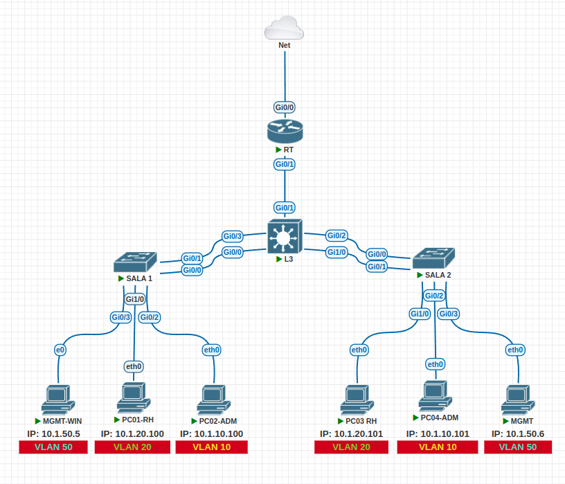

# Projeto: Configuração de Rede e VLANs  
Este repositório documenta a configuração de uma rede com segmentação VLANs e serviços essenciais para otimizar desempenho e segurança em um ambiente de rede. 

## 🛠️ **Configurações Realizadas**  
### VLANs Criadas:  
- **VLAN 50 (MGMT):** 10.1.50.0/29  
- **VLAN 10 (ADM):** 10.1.10.0/24  
- **VLAN 20 (RH):** 10.1.20.0/24  
- **VLAN 100 (LIXO):** Reservada  

### Dispositivos Configurados:  
- **Roteador (RT):** Interface VLAN 50 - IP 10.1.50.1/29  
- **Switch L3:** Interface VLAN 50 - IP 10.1.50.2/29  
- **Sala 1:** Interface VLAN 50 - IP 10.1.50.3/29  
- **Sala 2:** Interface VLAN 50 - IP 10.1.50.4/29  

## 🚀 **Serviços Implementados**  
- **VTP:** Gerenciamento centralizado de VLANs  
- **VLANs:** Segmentação para melhorar segurança e desempenho  
- **NAT/PAT:** Comunicação externa para VLANs  
- **ACL:** Restrições de tráfego inter-VLANs  
- **LACP:** Agregação de links do L3 aos SW das salas.
- **SSH:** Acesso seguro aos dispositivos  

## 📚 **Documentação Detalhada**  
Para mais detalhes sobre a configuração, consulte os arquivos na pasta `/docs`.  

--- 
